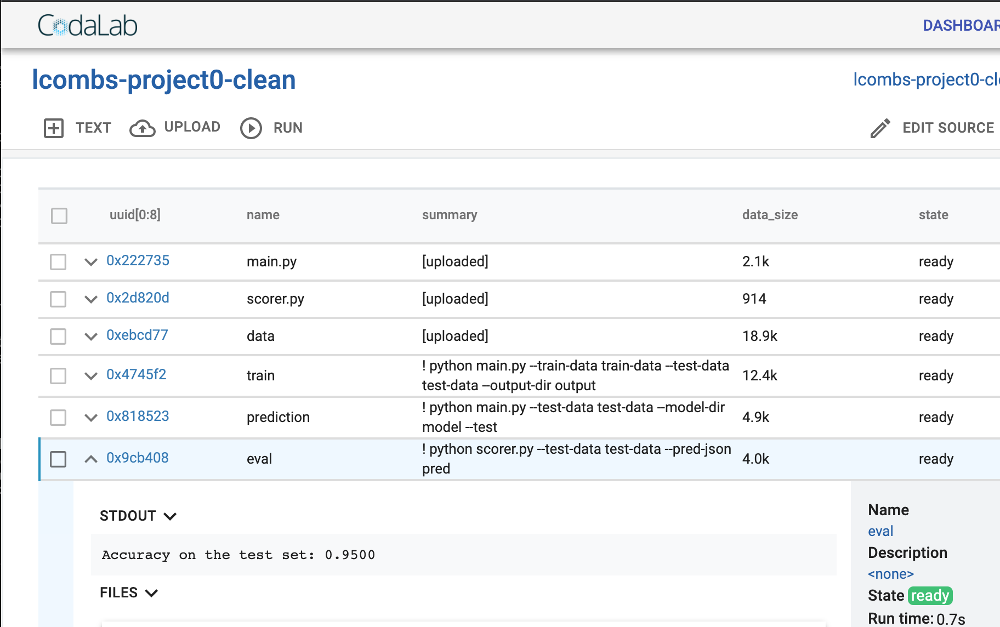
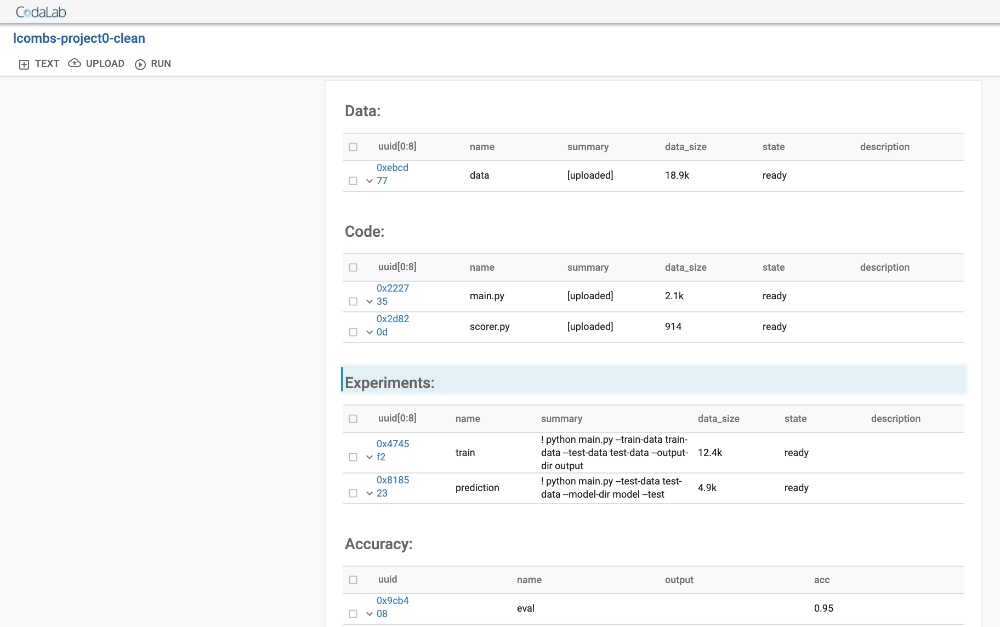

### First CodaLab Tutorial:
(This is not mandatory, but is simpler than project0 if you want to start from the very beginning).
	- Time: About 15min

Formal Instructions: https://github.com/codalab/worksheets-examples/tree/master/00-quickstart

- (1) Create and Verify Codalab account via http://worksheets.codalab.org. Also create a worksheet for each CL workflow we want to test (i.e. I have tutorial, project0 and will make one for our project)

- (2) Install Codalab on your computer within a venv in the directory you have the files (i.e. project folder)
	- $ virtualenv -p python codalabenv
	- $ . codalabenv/bin/activate
	- (codalabenv) $ pip install codalab -U
	
- (3) Start using Codalab (you may need to input username and password the first time)
	- (codalabenv) $ cl work
	Currently on worksheet: https://worksheets.codalab.org/worksheets/0xcd1b1a8828594c418ff8b89a95a7d882 (home-lcombs)
	
	- Make sure you are one the worksheet you want to be on for this project … you should pre-create this worksheet online 
		- (codalabenv) $ cl work lcombs-Cltutorial
			- Switched to worksheet: https://worksheets.codalab.org/worksheets/0x7fb20abf50114d38a1d881e05f73d95d (lcombs-CLtutorial)
		- You can switch back to home using $ cl work main::

- (4) Now we can upload our files to run on codalab: 
	- We need: 
		- Data (train, test)
		- Code (train, fit, score)
		- Optional - Images 
	- Commands: 
		- Upload the data folder: $ cl upload data
		- Upload the code folder: $ cl upload code
		- Run the workflow: $ cl run :data :code 'python code/sort.py < data/lines.txt'
	- Check back at your worksheet online --> should be "ready" under run-python
		- Note: we can rename the output directly or online


### Project0 CodaLab Tutorial

Time: About 20-30min 

Formal Instructions: 
	- Project 0: https://github.com/cp71/DS-GA-1003-SPRING-2020-PUBLIC/tree/master/projects/project_0
	- Docker: https://codalab-worksheets.readthedocs.io/en/latest/Execution/#specifying-environments-with-docker
		- Note: we need to copy the docker file to our workflow so we can build the docker image.
	- CodaLab: https://worksheets.codalab.org/worksheets/0x4405ecda88c94e51a978d921986dc1be

- (1) Test the workflow by training your model locally according to the instructions. Make sure to test the workflow out locally first because debugging is not easy in codalab. We should upload our final scripts only to Dockerhub and Codalab.
	- Go to project0 directory
		- python main.py --train-data data/iris/train.csv --test-data data/iris/dev.csv --output-dir output
		- python main.py --test-data data/iris/dev.csv --test --model-dir output --output-dir .
		- python scorer.py --test-data data/iris/dev.csv --pred-json preds.json
- (2) Upload to DockerHub (make sure you created and verified an account) 
	- This needs to be run from where we have the Dockerfile.
	- After this, it is similar to git/github.
	- $ docker build -t lcombs/dsga1003:test04 . 
		- Note: lcombs is your dockerhub ID and dsga1003:test04 is the name our image and we are uploading everything .
		- You should get : Successfully tagged lcombs/dsga1003:test04
	- View the images: $ docker images
	- We want to upload (push) the image we created to dockerhub: 
		- docker tag lcombs/dsga1003 lcombs/dsga1003:test04
		- You can check it is uploaded online on your profile.
(3) Run the workflow on CodaLab: 
	- Go to the worksheet for project0 you created 
		- $ cl work lcombs-project0-clean
	- Upload the files we need (i.e. data, code)
		- Check the files we have: $ cl ls
		- Data:
			- $ cl upload data
		- Code:
			- $ cl upload main.py 
			- $ cl upload scorer.py
	- Run the workflow (note commands come from the tutorial by professor via zoom last week):
		- $ cl run :main.py train-data:data/iris/train.csv test-data:data/iris/dev.csv 'python main.py --train-data train-data --test-data test-data --output-dir output' --request-docker-image lcombs/dsga1003
			- Name this "train"
			- Output is a bundle: 0x6432bc58ba46472f840f3ff8c30f8bd0
			- Note: there is a way to name these in the command so we can eventually do this.
		- $ cl run :main.py test-data:data/iris/dev.csv model:train/output 'python main.py --test-data test-data --model-dir model --test' --request-docker-image lcombs/dsga1003 -name prediction
			- View: This contains preds.json
		- $ cl run :scorer.py test-data:data/iris/dev.csv pred:prediction/preds.json 'python scorer.py --test-data test-data --pred-json pred' --request-docker-image lcombs/dsga1003 --name eval
	- Online results: 
	
	- Clean the Rmd file so that others can understand the bundle:
		- "Edit Source" using markdown syntax: 
			- i.e. ## Data
			- Show results from json:
			
		```	
		## Data:
		[dataset data]{0xebcd773e52cf4137a747f180218cb1f0}

		## Code:
		[dataset main.py]{0x222735750e784939bd6b2369258e740d}
		[dataset scorer.py]{0x2d820d2588e44606aa2abb43ec75d419}

		## Experiments:
		[run train -- :main.py,train-data:data/iris/train.csv,test-data:data/iris/dev.csv : python main.py --train-data train-data --test-data test-data --output-dir output]{0x4745f28d85df4f6cb470c26712501f4b}
		[run prediction -- :main.py,test-data:data/iris/dev.csv,model:train/output : python main.py --test-data test-data --model-dir model --test]{0x818523613783418f80402d88a0cc6418}
		
		## Accuracy:
		% schema result
		% add uuid uuid '[0:8]'
		% add name
		% add output /stdout
		% add acc /results.json:acc
		% display table result
		[run eval -- :scorer.py,test-data:data/iris/dev.csv,pred:prediction/preds.json : python scorer.py --test-data test-data --pred-json pred]{0x9cb408c1863244079b301d6d39c6bd6d}
		```
- Additional notes: 
	- We can use codalab to display the different experiments we ran (i.e. if we want to run different hyper-parameters or model methods) and show their accuracies.
	- We do not need to "submit" on codalab since there will be no competition, but the professor will use the codalab link as extra credit since it makes it easier to make reproducible results via docker and codalab workflow across different data scientists and machines.
	

- Conclusion : We need:
	- Dockerfile --> copy from project0 
	- Data --> test and train data saved in a single directory separately (csv OK)
	- Code --> main script for train & test, scorer script for eval
	- We can submit something like this for the final report: https://worksheets.codalab.org/worksheets/0x49a52a8cc3d94b3982f47c9fbc44892c

- See raw terminal output for additional demo.